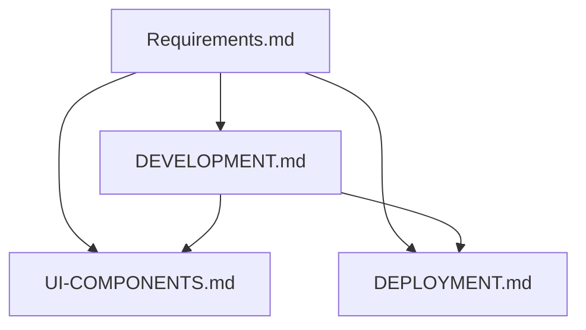

# LuxeJapan 项目文档

## 文档结构
- [项目需求书](../Requirements.md) - 项目整体需求说明
- [开发规范](./DEVELOPMENT.md) - 开发规范、多语言和 SEO 实现
- [UI 组件设计规范](./UI-COMPONENTS.md) - UI 组件、动画和交互规范
- [部署文档](./DEPLOYMENT.md) - 部署流程和配置

## 文档关系


## 文档更新记录
| 日期 | 版本 | 更新内容 | 更新人 |
|------|------|----------|--------|
| 2024-03-20 | 1.0.0 | 初始文档创建 | - |
| 2024-03-20 | 1.0.1 | 文档结构优化 | - |

## 项目简介
重构 [luxejapan-public](https://luxejapan.github.io/luxejapan-public/#/zh-tw/about) 静态网站，使用 Next.js 14 + TypeScript + Tailwind CSS 开发。

## 快速开始
```bash
# 安装依赖
npm install

# 开发环境
npm run dev

# 构建
npm run build
```

## 项目结构
```
src/
├── app/                # 页面组件
├── components/        # 可复用组件
├── lib/              # 工具函数
└── styles/           # 样式文件
```

## 开发指南
1. 克隆仓库
2. 安装依赖
3. 启动开发服务器
4. 开始开发

## 文档导航
- [开发规范](./DEVELOPMENT.md)
- [UI 组件设计规范](./UI-COMPONENTS.md)
- [部署文档](./DEPLOYMENT.md) 